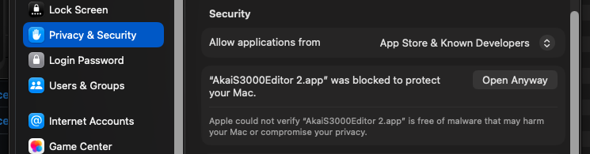
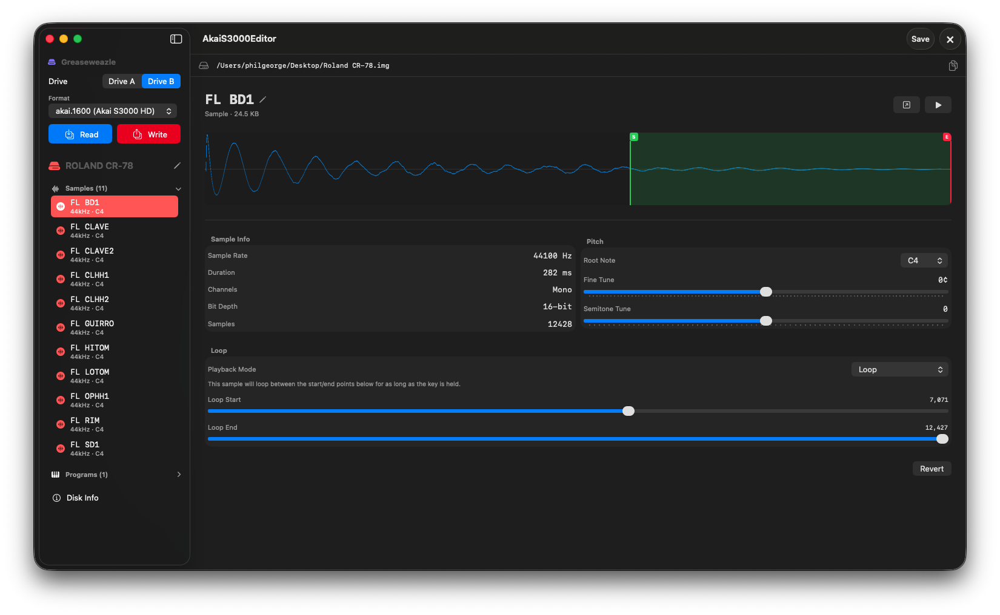
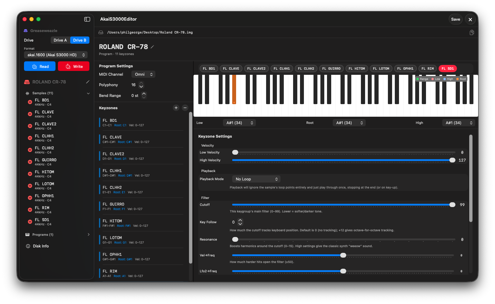
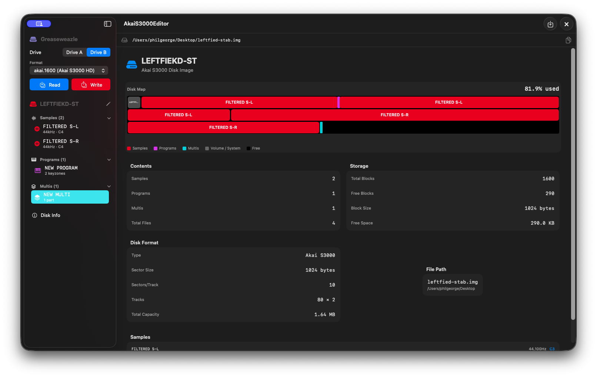
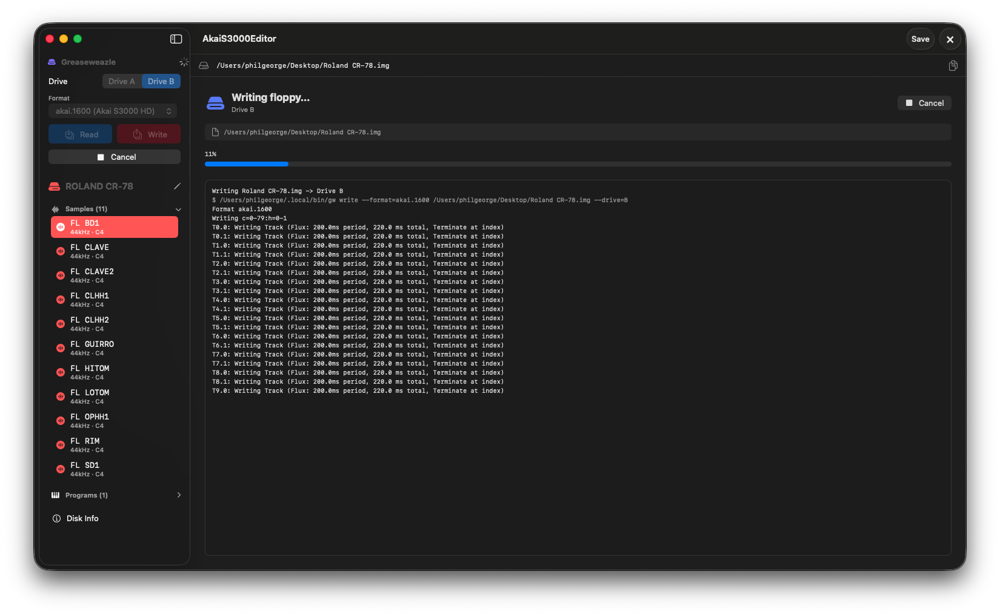

# Akai S3000 Floppy Disk Editor


I love the sound of Akai samplers. Maybe it’s just me, but when I play back old drum and bass loops from the 90s, they sound MASSIVE! Sure, plugin samplers are easy to use, but they just seem to lack the magic of going through the crunch and op amps of the Akais. I also love the simplicity of being restricted to a 1.4Mb floppy disk — it really does make you think, “I need to choose my samples carefully, every one must be a banger and cut through the mix!"

This is a personal macOS project that allows me to read and write Akai S3000XL floppy disks using a UI that is super easy and powerful: quickly create programs, then drag and drop WAV files into program or drum key group configs with filter and loop settings, then save to an .img file. For reading and editing Akai S3000 floppy disk images (.img), I use the AMAZING [Greaseweazle](https://github.com/keirf/greaseweazle) floppy-to-USB-C card.

My app is built with SwiftUI — no dependencies — so it should run on most modern Macs. You will need to edit permissions in Settings to trust it, as it’s not on the App Store yet!

**[View on GitHub](https://github.com/pageorge/Akai-S3000-Floppy-Disk-Editor)**

---

## Download

**[⬇️ Download latest build](https://github.com/pageorge/Akai-S3000-Floppy-Disk-Editor/releases/latest)**

1. Download `AkaiS3000Editor.zip` from the link above
2. Run the App
3. On first launch modern Mac will say it can't run, go in to Settings -> Privacy & Security -> Open Anyway - I trust this guy!


<p align="center">
  
</p>

---

## Screenshots

<table>
  <tr>
    <td width="50%" valign="top">
      
      <p align="center">Drag in a sample, tweak loop points etc...</p>
    </td>
    <td width="50%" valign="top">
      
      <p align="center">Easily create new or clone keyzones, create a drum program by dragging in multiple samples on to the drum drop zone! Set filter settings</p>
    </td>
  </tr>
  <tr>
    <td width="50%" valign="top">
      
      <p align="center">Floppy disk info and a map of where everything will live on the disk</p>
    </td>
    <td width="50%" valign="top">
      
      <p align="center">Read / Write buttons call Greaseweazle commands and show log and progress writing to disk</p>
    </td>
  </tr>
</table>

---

## Requirements

- **macOS 14 Sonoma** or later
- No third-party dependencies

To build from source: **Xcode 15** or later.

---

## All source code is available - if you want to building it yourself:

1. Clone this repo
2. Open `AkaiS3000Editor.xcodeproj` in Xcode
3. Set your Development Team in Signing & Capabilities
4. Press **⌘R**

---

### Tips & Tricks

## How to create a new program on the S3000XL

There's no separate "blank new program" function — every new program is made by copying an existing one (most simply, the built-in default TEST PROGRAM, which is what loads when you go into EDIT SINGLE for the first time):

1. Go to EDIT PROGRAM → SINGLE. You'll land on the main screen showing whatever program is currently selected (e.g. `program: TEST PROGRAM`).
2. Press the NAME key. The front panel keys become a letter keyboard, and you'll see: `LETTERS .. (NAME for numbers ENT to exit)`
3. Type your new program's name (up to 12 characters, uppercase only). Use CURSOR keys + the DATA wheel to move around and scroll through characters if you don't want to type letter-by-letter; +/< and -/> on the numeric keypad give you backspace and space.
4. Press ENT. You'll get: `Select: [COPY] [REN] [exit]`
5. Press COPY. This duplicates whatever program was currently loaded (e.g. TEST PROGRAM) under your new name — that's your new program.

A few things worth knowing:

- If the name you typed already exists, it'll show `*existing Prog*` and then `!! MUST USE A DIFFERENT NAME !!` — just enter a unique name and try again.
- REN (instead of COPY) renames the current program in place rather than making a copy — not what you want for a new program.
- Since it's always a copy of something, the cleanest "from scratch" approach (and the one the manual itself recommends) is to make sure TEST PROGRAM is the currently loaded program before you start naming — that's the single-keygroup default, so your "new" program starts simple rather than inheriting a complex existing one's keygroups/filter settings.

---

## Technical Reference: Akai S3000 Disk Format

A compact map of the on-disk format, sourced from [Midi-In/akaiutil](https://github.com/Midi-In/akaiutil) (primary struct source), [keirf/GreaseWeazle](https://github.com/keirf/greaseweazle) (physical track layout), and the Akai S3000XL Operator's Manual (parameter semantics/ranges), with several offsets confirmed/corrected by direct hardware testing.

### Physical layout (`akai.1600` / `akai.800`)

| | `akai.1600` (HD) | `akai.800` (LD) |
|---|---|---|
| Cylinders | 80 | 80 |
| Heads | 2 | 1 |
| Sectors/track | 10 | 10 |
| Bytes/sector | 1024 | 1024 |
| Total blocks | 1600 | 800 |
| Data rate | 500 kbps (MFM HD) | 250 kbps (MFM DD) |

### Floppy header (`akai_flhhead_s`) — blocks 0–4, 5120 bytes

| Offset | Field | Size | Notes |
|---|---|---|---|
| `0x0000` | `file[64]` | 0x600 | Floppy-header directory copy. On S3000 disks, slot 0 is a sentinel (type `0xFF`, name `VVVVVVVVVVVV`); the real directory lives elsewhere (see below). |
| `0x0600` | `fatblk[1600][2]` | 0xC80 | FAT: 16-bit LE per block. |
| `0x1280` | `label` (`akai_flvol_label_s`) | 0x40 | Volume name (12 bytes) + 2 reserved + OS version (2 bytes) + 0x30 params. |
| `0x12C0` | padding | 0x140 | Unused. |

### Live volume directory — `akai_voldir3000fl_s`

Starts at **block 5**, 510 × 24-byte entries, spans 12 blocks.

### FAT codes

| Code | Meaning |
|---|---|
| `0x0000` | Free |
| `0x4000` | System (header + directory) |
| `0x8000` | End of directory's own chain (S3000) |
| `0xC000` | End of file chain |
| other | Next block number (16-bit LE) |

### Volume directory entry (`akai_voldir_entry_s`) — 24 bytes

| Offset | Field | Notes |
|---|---|---|
| `0x00`–`0x0B` | `name[12]` | Akai-encoded. |
| `0x0C`–`0x0F` | `tag[4]` | S3000 free = `0x00`; S1000 default = `0x20`. |
| `0x10` | `type` | `0x00`=free, `0xF3`=sample, `0xF0`=program. |
| `0x11`–`0x13` | `size[3]` | 24-bit LE, total bytes incl. header. |
| `0x14`–`0x15` | `start[2]` | 16-bit LE start block. |
| `0x16`–`0x17` | `osver[2]` | Samples=`0x0000`; programs=`0x1100`. |

### Sample header (`akai_sample3000_s`) — 0xC0 (192) bytes, audio follows immediately

| Offset | Field | Notes |
|---|---|---|
| `0x00` | `blockid` | `0x03`. |
| `0x01` | `bandw` | `0x00`=10kHz, `0x01`=20kHz. |
| `0x02` | `rkey` | MIDI root key. |
| `0x03`–`0x0E` | `name[12]` | Akai-encoded. |
| `0x10` | `lnum` | Number of loops. |
| `0x11` | `lfirst` | First active loop − 1. |
| `0x13` | `pmode` | `0x00`=Loop, `0x01`=Loop Until Release, `0x02`=No Loop, `0x03`=Play to End. |
| `0x14` | `ctune` | Cents tune, signed. |
| `0x15` | `stune` | Semitone tune, signed. |
| `0x16`–`0x19` | `locat[4]` | Sampler-managed address. |
| `0x1A`–`0x1D` | `slen[4]` | Number of samples. |
| `0x1E`–`0x21` | `start[4]` | Start marker. |
| `0x22`–`0x25` | `end[4]` | End marker. |
| `0x26`–`0x85` | `loop[8]` | 8 × 12 bytes: `at[4]`, `flen[2]`, `len[4]`, `time[2]`. |
| `0x88`–`0x89` | `stpaira[2]` | Stereo-pair partner header address; `0xFFFF`=none. |
| `0x8A`–`0x8B` | `srate[2]` | Sample rate, Hz, 16-bit LE. |
| `0x8C` | `hltoff` | HOLD loop tune offset. |
| `0xC0`+ | audio | 16-bit signed LE PCM, mono. |

### Program header (`akai_program3000_s`) — 0xC0 bytes, keygroups follow

| Offset | Field | Notes |
|---|---|---|
| `0x00` | `blockid` | `0x01`. |
| `0x01`–`0x02` | `kg1a[2]` | Address of keygroup 1, sampler-managed. |
| `0x03`–`0x0E` | `name[12]` | Akai-encoded. |
| `0x10` | `midich1` | `0xFF`=Omni, else 0-indexed channel. |
| `0x13` | `keylo` | Program-level low key. |
| `0x14` | `keyhi` | Program-level high key. |
| `0x15` | `oct` | Octave offset, signed. |
| `0x16` | `auxch1` | `0xFF`=off. |
| `0x17` | Stereo Level | 0–99, OUTPUT LEVELS page. Master volume at the main L/R outs. **CONFIRMED by real-hardware byte-diff** (isolated test `0x00`→`0x63`(99)) — found diagnosing a real "no audio at all" bug: this app previously always wrote 0 here, which silently mixes the program out of the L/R bus entirely. Now defaults to 99. |
| `0x19` | Basic Loudness | 0–99, OUTPUT LEVELS page, LOUDNESS CONTROL column. Base loudness before velocity sensitivity is applied. **CONFIRMED by real-hardware byte-diff** (isolated test `0x00`→`0x50`(80)) — same silence bug as Stereo Level; real factory TEST PROGRAM shows 80 by default, this app now defaults to 99. |
| `0x29` | `kgxf` | Keygroup crossfade enable. |
| `0x2A` | `kgnum` | Number of keygroups (must match actual count). |
| `0x54` | Filter mod source #1 | Index 0–13 into the 14-option list (see Filter section below). **CONFIRMED by real-hardware byte-diff** (isolated test `0x00`→`0x01`, "No Source"→"Modwheel"). Default index 5 (Velocity). Despite being shown on each keygroup's FILT page, this is a PROGRAM-WIDE setting — one shared value for the whole program, not per-keygroup. |
| `0x55` | Filter mod source #2 | Same as `0x54`, slot #2. **CONFIRMED** the same way. Default index 8 (Lfo2). |
| `0x56` | Filter mod source #3 | Same as `0x54`, slot #3. **CONFIRMED** the same way. Default index 10 (Env2). |

### Program keygroup (`akai_program3000kg_s`) — 0xC0 bytes each, starting at file offset `0xC0`

| Offset (in keygroup) | Field | Notes |
|---|---|---|
| `0x00` | `blockid` | `0x02`. |
| `0x03` | `keylo` | Low MIDI key. |
| `0x04` | `keyhi` | High MIDI key. |
| `0x07` | `filter` (Frequency/cutoff) | 0–99, direct value. Hardware-confirmed. |
| `0x08` | Key Follow | Signed. Real blank-keygroup default is **0**, not the manual's stated +12. Hardware-confirmed. |
| `0x95` | Resonance | 0–15, direct. Hardware-confirmed; outside akaiutil's documented struct entirely. |
| `0x97` | Filter mod depth #1 (Velocity→Freq) | ±50, signed. Hardware-confirmed. |
| `0x98` | Filter mod depth #2 (Lfo2→Freq) | ±50, signed. Hardware-confirmed. |
| `0x99` | Filter mod depth #3 (Env2→Freq) | ±50, signed. Hardware-confirmed. |
| `0x22`, `+0x18`, `+0x30`, `+0x48` | 4 × velocity zones | 0x18 bytes each (table below). |

### Velocity zone (`akai_program1000kgvelzone_s`) — 0x18 (24) bytes

| Offset | Field | Notes |
|---|---|---|
| `0x00`–`0x0B` | `sname[12]` | Sample name, Akai-encoded. |
| `0x0C` | `vello` | Low velocity. |
| `0x0D` | `velhi` | High velocity. |
| `0x0E` | `ctune` | Cents tune, signed. |
| `0x0F` | `stune` | Semitone tune, signed. |
| `0x10` | `loud` | Loudness offset, signed. |
| `0x11` | `filter` (cutoff trim) | ±50, signed. Layered on top of the keygroup's Frequency. |
| `0x12` | `pan` | Pan offset, signed. |
| `0x13` | `pmode` | `0x00`=Sample's Setting, `0x01`=Loop, `0x02`=Loop Until Release, `0x03`=No Loop, `0x04`=Play to End. |
| `0x16`–`0x17` | `shdra[2]` | Sample header address; `0xFFFF`=none. |

Each keygroup has 4 of these zones (`+0x22`, `+0x18` each). This app actively uses **zone 1** (the main sample, `AkaiProgramKeyzone.sampleName`) and **zone 2** (an optional stereo right channel, `AkaiProgramKeyzone.rightSampleName`/`rightPan`) — zones 3–4 are left as empty placeholders.

**Stereo playback is one keygroup with two zones, not two keygroups** — confirmed by the S3000XL Operator's Manual (p.51–52): *"the left and right samples are assigned to their own zones (1 and 2 respectively) in one keygroup and each zone is panned hard left and hard right"*, and explicitly: *"a stereo program with 5 keygroups would typically show 10 samples (5 x L and R)."* Recording in STEREO on real hardware produces two separate MONO sample files (suffixed `-L`/`-R`) — there's no native stereo sample format on the S3000 — which this app's WAV import already matches. The app exposes zone 2 as a second "Stereo Right Channel" pill row in the program editor; assigning a sample there sets zone 1 to hard left (−50, if it was still centered) and zone 2 to hard right (+50) automatically, matching the real hardware default, with both adjustable afterward.

### Filter — mod sources CONFIRMED (and a surprise: they're program-level, not per-keygroup)

The 3 mod-depth source options are fully confirmed (captured directly off a real S3000XL screen, see `AkaiFilterModSource`): **No Source, Modwheel, Bend, Pressure, External, Velocity, Key, Lfo1, Lfo2, Env1, Env2, !Modwheel, !Bend, !External** — 14 total (raw values 0–13, matching this exact cycle order), with only Modwheel/Bend/External getting a note-on-only "!" variant.

**Byte offsets are also confirmed** — program header `0x54`/`0x55`/`0x56`, one byte per slot, each storing a direct index (0–13) into the list above. Found via a sequence of isolated single-variable hardware tests: change ONLY one slot's source from "No Source" to "Modwheel", leave everything else untouched, SAVE+GO, diff against the previous capture — each round produced exactly one new changed byte (`0x54`, then `0x55`, then `0x56`, each going `0x00`→`0x01`).

**Important discovery along the way:** although each keygroup's FILT page displays its own source dropdowns, these 3 bytes live in the **program header** (`0x00`–`0xBF`), not in any keygroup's own `0xC0`-byte region. That means the source choice is **shared by every keygroup in the program** — only the *depth amount* (`0x97`/`0x98`/`0x99` on each keygroup) is genuinely per-keygroup. This was found by accident: an early two-keygroup test diff showed the change landing in the header rather than either keygroup's body. The app's UI reflects this: the 3 source pickers live in Program Settings (apply to the whole program), while each keygroup's Filter section only shows the depth sliders, with the current (shared) source name displayed read-only for context.

Still open: ENV2's own 4-stage rate/level envelope (semantics confirmed by the manual, no byte offsets investigated).

### Akai character encoding

| Code | Char | Code | Char |
|---|---|---|---|
| `0`–`9` | `'0'`–`'9'` | `37` | `'#'` |
| `10` | `' '` | `38` | `'+'` |
| `11`–`36` | `'A'`–`'Z'` | `39` | `'-'` |
| | | `40` | `'.'` |

### MULTI files — ALL 16 parts CONFIRMED and fully editable

MULTI files (`AKAI_MULTI3000_FTYPE`, `'m'+0x80`) let a real S3000XL layer up to 16 programs together, each on its own MIDI channel with its own level/pan/FX send (manual, p.37–38, the "MIX" page). Unlike every other format in this README, **akaiutil has no struct at all for this file type** — only the bare file-type byte and default name (`"MULTI FILE"`). Every other offset in this document started from at least a partial struct skeleton that hardware testing then confirmed; MULTI started from nothing, and was reverse-engineered entirely from scratch via isolated hardware byte-diff tests.

**Confirmed** (8 captures total: a baseline, one isolated change per field on Part 1, plus one more isolating the per-part stride via Part 2):

| Offset | Field | Notes |
|---|---|---|
| `0x000`–`0x3FF` | Multi-level header | Not yet investigated (1024 bytes). |
| `0x400 + (N-1)×0xC0` | Part N's record base (N=1...16) | **Stride confirmed**: Part 2 landed exactly `0xC0` (192) bytes after Part 1. `header(0x400) + 16×0xC0 = 0x1000 (4096)` exactly matches every multi file's real size — no ambiguity. |
| `+0x00` | Record marker | Constant `0x01` — purpose unconfirmed. |
| `+0x01`–`+0x02` | Program link pointer | 2 bytes, sampler-managed (same pattern as `kg1a`/`shdra` elsewhere) — recalculated whenever the program assignment changes; not written by this app. |
| `+0x03`–`+0x0E` | **Program name** | 12 bytes, Akai-encoded. Confirmed on both Part 1 and Part 2, byte-for-byte. |
| `+0x0F` | Separator/padding | Unconfirmed. |
| `+0x10` | **Channel** | 0-indexed. Confirmed: `0x00`→`0x01` for channel 1→2. |
| `+0x11`–`+0x16` | Unconfirmed gap | 6 bytes. |
| `+0x17` | **Level** | 0–99 direct. Confirmed: default `99`→`56`, matches the real hardware default shown on screen. |
| `+0x18` | **Pan** | Signed. Confirmed: default `0`→`2`. |
| `+0x19`–`+0x70` | Unconfirmed gap | 88 bytes — may hold fields from the OUT/TUNE/RNGE/PRIO tabs visible on the same hardware screen, or may be padding. |
| `+0x71` | **Fx bus** | Index 0–4. Confirmed: `0`(OFF)→`1`(FX1). FX2/RV3/RV4 = 2/3/4 inferred from cycle order, not independently isolated. |
| `+0x72` | **Send** | 0–99 direct. Confirmed: default `25`→`60`, matches the real hardware default shown on screen. |
| `+0xBE`–`+0xBF` | Second link pointer | 2 bytes, sampler-managed, confirmed present on both Part 1 and Part 2 (resolves from `0xFFFF`/none once a program is assigned — same convention as a velocity zone's `shdra`). Not written by this app. |

This app **reads and writes ALL 16 parts of a real MULTI file** using these confirmed offsets (`AkaiMultiFormat`, `applyMultiPartEdit`) — editable directly from the Multis tab when you select a real file. Everything outside the confirmed fields (the multi-level header and the two small per-part gaps) is read but never written, preserved byte-for-byte.

**Not yet confirmed:**
- The two small unconfirmed gaps within each part's own record.
- The multi-level header's internal layout (bytes `0x000`–`0x3FF`), including wherever the multi's own name is stored — renaming currently only patches the directory entry's name, not any internal field.

Creating a **brand-new** multi file from scratch on disk still isn't possible — that would need writing the multi-level header and the per-part link pointers, neither of which is understood yet. The app's **"New Multi (Preview)" editor** (same MIX-page UI, reused) remains available for planning a multi before it has a backing file, clearly banner-marked as not yet saveable for that specific case.

---

### Reading a floppy with GreaseWeazle

```bash
gw read --format=akai.1600 my_disk.img --drive=B
```

## Special thanks

This project wouldn't have been possible without the open-source work of people who reverse-engineered the Akai disk format before me. Huge thanks to:

- **[Midi-In / akaiutil](https://github.com/Midi-In/akaiutil)** — the definitive reference for S1000/S3000 character encoding, FAT structure, and file types. The `akai2ascii` function saved the day.
- **[dialtr / akai-fs](https://github.com/dialtr/akai-fs)** — another invaluable reference for filesystem parsing, WAV export logic, and sample header layout.
- **[keirf / GreaseWeazle](https://github.com/keirf/greaseweazle)** — the hardware and software that makes reading real Akai floppies on modern hardware possible. The `akai.1600` format definition was exactly what was needed.
- **The original Akai S3000XL Operator's Manual** — the missing piece for *semantics*, not just byte layout. Confirmed real units/ranges/behavior for sample and program playback modes and the filter section that the open-source utilities above never fully documented.

---

## Useful links

- [GreaseWeazle](https://github.com/keirf/greaseweazle) — floppy imaging hardware & software
- [akaiutil (Midi-In)](https://github.com/Midi-In/akaiutil) — S1000/S3000 filesystem utility
- [akai-fs (dialtr)](https://github.com/dialtr/akai-fs) — another Akai filesystem implementation
- [Akai S3000XL Wikipedia](https://en.wikipedia.org/wiki/Akai_S3000XL) — background on the sampler

---

*Personal project — use at your own risk. Always keep backups of your disk images before saving changes.*
