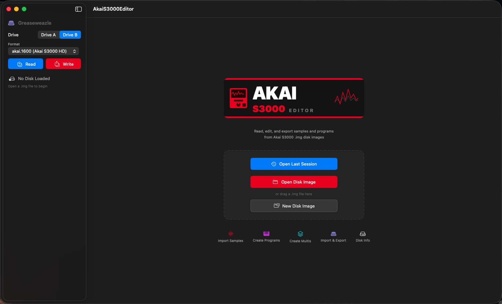
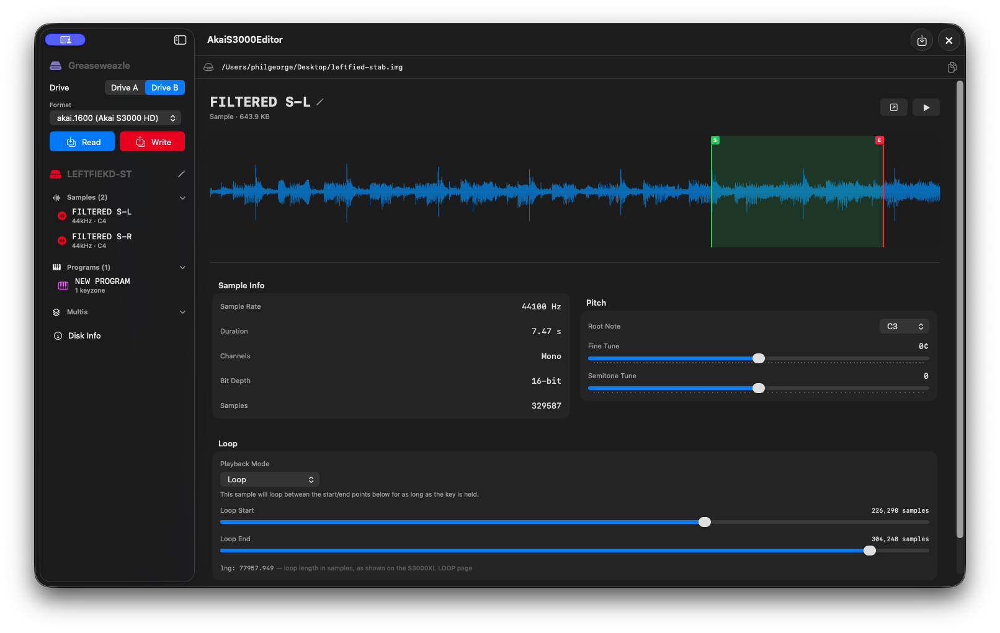
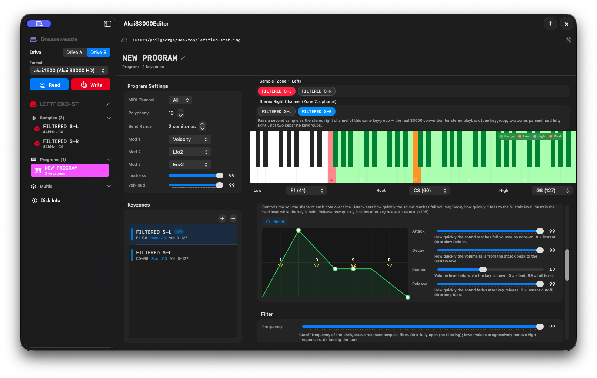
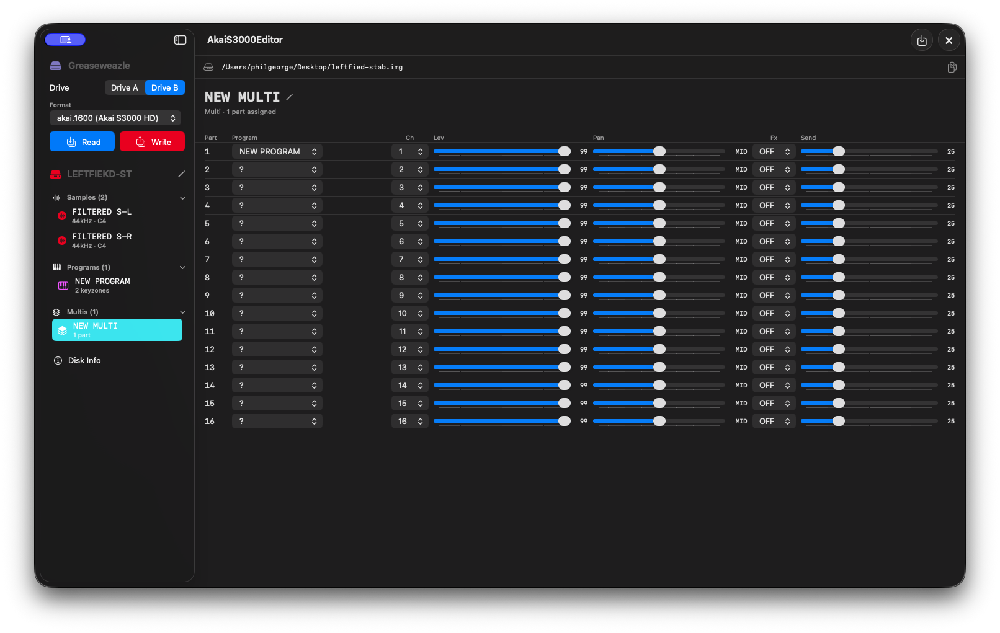

# Akai S3000 Floppy Disk Editor


This is a personal macOS project that allows me to read and write Akai S3000XL floppy disks using a UI that is super easy and powerful: quickly create programs, then drag and drop WAV files into program or drum key group configs with filter and loop settings, then save to an .img file. For reading and editing Akai S3000 floppy disk images (.img), I use the AMAZING [Greaseweazle](https://github.com/keirf/greaseweazle) floppy-to-USB-C card.

My app is built with SwiftUI — no dependencies — so it should run on most modern Macs. You will need to edit permissions in Settings to trust it, as it's not on the App Store yet!

**[View on GitHub](https://github.com/pageorge/Akai-S3000-Floppy-Disk-Editor)**

---

## Download

**[⬇️ Download latest build](https://github.com/pageorge/Akai-S3000-Floppy-Disk-Editor/releases/latest)**

1. Download `AkaiS3000Editor` from the link above
2. Run the App
3. On first launch modern Mac will say it can't run, go in to Settings -> Privacy & Security -> Open Anyway - I trust this guy!

<p align="center">
  
</p>

---

## Screenshots

<table>
  <tr>
    <td valign="top">
      <h3>Open last session, open an existing image or create a new image</h3>
      
    </td>
  </tr>
  <tr>
    <td valign="top">
      <h3>Drag in multiple wav/aiff samples and setup loop points</h3>
      
    </td>
  </tr>  
  <tr>    
    <td valign="top">
      <h3>Create or clone keyzones, create a drum program by dragging in multiple drum samples at once. Set filter mods and ADSR graph</p>
      
    </td>
  </tr>
  <tr>
    <td width="50%" valign="top">
      <h3>Create multis and assign programs</h3>
      
    </td>
  </tr>
  <tr>
    <td width="50%" valign="top">
      <h3>Read / Write buttons call Greaseweazle commands and show log and progress writing to disk</h3>
      
    </td>
  </tr>
  
  <tr>
    <td valign="top">
      <h3>Floppy disk info and a map of where everything will be saved on disk</h3>
      
    </td>
  </tr>
  
</table>

---

## Requirements

- **macOS 14 Sonoma** or later
- No third-party dependencies

To build from source: **Xcode 15** or later.

---

## Building from source

1. Clone this repo
2. Open `AkaiS3000Editor.xcodeproj` in Xcode
3. Set your Development Team in Signing & Capabilities
4. Press **⌘R**

---

## Tips & Tricks

### How to create a new program on the S3000XL

There's no separate "blank new program" function — every new program is made by copying an existing one (most simply, the built-in default TEST PROGRAM):

1. Go to EDIT PROGRAM → SINGLE
2. Press **NAME**, type your new program name (up to 12 characters, uppercase only), press **ENT**
3. Press **COPY** — this duplicates the current program under your new name

### How to use Multis

The S3000XL holds only one multi in memory at a time, but any number may be saved to disk (manual, p.35). Save named multis to disk and load whichever you need per session via **LOAD → MULTI+PROGS+SAMPS**.

**Note:** Hardware testing suggests the firmware always loads the first multi in the directory regardless of which file is selected from the load list. This appears to be a firmware behaviour.

---

## Technical Reference: Akai S3000 Disk Format

Sources: [Midi-In/akaiutil](https://github.com/Midi-In/akaiutil), [keirf/GreaseWeazle](https://github.com/keirf/greaseweazle), Akai S3000XL Operator's Manual, and direct hardware byte-diff testing.

### Physical layout

| | `akai.1600` (HD) | `akai.800` (LD) |
|---|---|---|
| Cylinders | 80 | 80 |
| Heads | 2 | 1 |
| Sectors/track | 10 | 10 |
| Bytes/sector | 1024 | 1024 |
| Total blocks | 1600 | 800 |
| Data rate | 500 kbps (MFM HD) | 250 kbps (MFM DD) |

### Floppy header (`akai_flhhead_s`) — blocks 0–4

| Offset | Field | Notes |
|---|---|---|
| `0x0000` | `file[64]` | Floppy-header directory copy. Slot 0 = S3000 volume sentinel (type `0xFF`). |
| `0x0600` | `fatblk[1600][2]` | FAT: 16-bit LE per block. |
| `0x1280` | `label` | Volume name (12 bytes, Akai-encoded). |

### Live volume directory

Starts at **block 5**, 510 × 24-byte entries, spans 12 blocks.

### FAT codes

| Code | Meaning |
|---|---|
| `0x0000` | Free |
| `0x4000` | System (header + directory) |
| `0xC000` | End of file chain |
| other | Next block number (16-bit LE) |

### Volume directory entry — 24 bytes

| Offset | Field | Notes |
|---|---|---|
| `0x00`–`0x0B` | `name[12]` | Akai-encoded. |
| `0x0C`–`0x0F` | `tag[4]` | S3000 free = `0x00`. |
| `0x10` | `type` | `0x00`=free, `0xF3`=sample, `0xF0`=program, `0xED`=multi. |
| `0x11`–`0x13` | `size[3]` | 24-bit LE, total bytes incl. header. |
| `0x14`–`0x15` | `start[2]` | 16-bit LE start block. |
| `0x16`–`0x17` | `osver[2]` | Samples=`0x0000`; programs=`0x1100`. |

### Other file types (not decoded or edited)

| Type byte | Name | Created by |
|---|---|---|
| `0x74` | Take List (TL1) | SAVE → SONG |
| `0x78` | Effects File | SAVE → EFFECTS |
| `0x64` | Drum Inputs | SAVE → DRUM |

### Sample header (`akai_sample3000_s`) — 0xC0 bytes, audio follows

| Offset | Field | Notes |
|---|---|---|
| `0x00` | `blockid` | `0x03`. |
| `0x01` | `bandw` | `0x00`=10kHz, `0x01`=20kHz. |
| `0x02` | `rkey` | MIDI root key. |
| `0x03`–`0x0E` | `name[12]` | Akai-encoded. |
| `0x10` | `lnum` | Number of loops. |
| `0x13` | `pmode` | `0x00`=Loop, `0x01`=Loop Until Release, `0x02`=No Loop, `0x03`=Play to End. |
| `0x14` | `ctune` | Cents tune, signed. |
| `0x15` | `stune` | Semitone tune, signed. |
| `0x16`–`0x19` | `locat[4]` | Sampler-managed address. |
| `0x1A`–`0x1D` | `slen[4]` | Number of samples. |
| `0x1E`–`0x21` | `start[4]` | Trim start marker. Not modeled — app treats buffer as starting at 0. |
| `0x22`–`0x25` | `end[4]` | Trim end marker. Not modeled. |
| `0x26`–`0x85` | `loop[8]` | 8 × 12 bytes: `at[4]`, `flen[2]`, `len[4]`, `time[2]`. `at` is the loop's **right-hand boundary** (return-to point) — region is `[at-len, at)`. Confirmed against factory SAWTOOTH sample on real hardware: `at=192, len=168, flen=36831` displayed as `lng: 168.562` (`len + flen/65536`). `flen` read for rounding, written back as 0. |
| `0x88`–`0x89` | `stpaira[2]` | Stereo-pair partner address; `0xFFFF`=none. |
| `0x8A`–`0x8B` | `srate[2]` | Sample rate Hz, 16-bit LE. |
| `0xC0`+ | audio | 16-bit signed LE PCM, mono. |

### Program header (`akai_program3000_s`) — 0xC0 bytes, keygroups follow

| Offset | Field | Notes |
|---|---|---|
| `0x00` | `blockid` | `0x01`. |
| `0x01`–`0x02` | `kg1a[2]` | Keygroup 1 address, sampler-managed. |
| `0x03`–`0x0E` | `name[12]` | Akai-encoded. |
| `0x10` | `midich1` | `0xFF`=Omni, else 0-indexed channel. |
| `0x13` | `keylo` | Program-level low key. |
| `0x14` | `keyhi` | Program-level high key. |
| `0x15` | `oct` | Bend range (semitones). |
| `0x16` | `auxch1` | `0xFF`=off. |
| `0x17` | Stereo Level | 0–99. Main L/R output level. `0x00` = silent on main outs. Default 99. **Hardware-confirmed.** |
| `0x19` | Basic Loudness | 0–99. Base loudness before velocity sensitivity. `0x00` = silent. Default 99. **Hardware-confirmed.** |
| `0x29` | `kgxf` | Keygroup crossfade enable. |
| `0x2A` | `kgnum` | Number of keygroups — must match actual count in file. |
| `0x54` | Filter mod source #1 | Index 0–13. Default 5 (Velocity). Program-wide. **Hardware-confirmed.** |
| `0x55` | Filter mod source #2 | Default 8 (Lfo2). Program-wide. **Hardware-confirmed.** |
| `0x56` | Filter mod source #3 | Default 10 (Env2). Program-wide. **Hardware-confirmed.** |

### Program keygroup (`akai_program3000kg_s`) — 0xC0 bytes each, from file offset `0xC0`

| Offset | Field | Notes |
|---|---|---|
| `0x00` | `blockid` | `0x02`. |
| `0x03` | `keylo` | Low MIDI key. |
| `0x04` | `keyhi` | High MIDI key. |
| `0x07` | Frequency (filter cutoff) | 0–99. **Hardware-confirmed.** |
| `0x08` | Key Follow | Signed. Factory default is 0 (not the manual's stated +12). **Hardware-confirmed.** |
| `0x0C` | ENV1 Attack | 0–99. **Hardware-confirmed** kg+0x0C. |
| `0x0D` | ENV1 Decay | 0–99. **Hardware-confirmed** kg+0x0D. |
| `0x0E` | ENV1 Sustain | 0–99. **Hardware-confirmed** kg+0x0E. |
| `0x0F` | ENV1 Release | 0–99. **Hardware-confirmed** kg+0x0F. |
| `0x14` | ENV2 Rate 1 | 0–99. Default 0. **Hardware-confirmed.** |
| `0x15` | ENV2 Rate 3 | 0–99. Default 50. **Hardware-confirmed.** |
| `0x16` | ENV2 Level 3 (sustain) | 0–99. Default 99. **Hardware-confirmed.** |
| `0x17` | ENV2 Rate 4 (release) | 0–99. Default 45. **Hardware-confirmed.** |
| `0x20`–`0x21` | `dummy2[1]/[2]` | Must be `0xFFFF`. These are the last 2 bytes of akaiutil's `dummy2[3]` field (at kg+0x1F–0x21, just before the velocity zones at 0x22). **Hardware-confirmed by byte-diff against working real programs** — programs written with `0x0000` here caused zone 1 to be silent (the hardware reads the zone 1 sample name starting 2 bytes late, missing it entirely). Always write `0xFFFF`. |
| `0x95` | Resonance | 0–15. **Hardware-confirmed.** Outside akaiutil's documented struct. |
| `0x97` | Filter mod depth #1 (Velocity→Freq) | ±50, signed. **Hardware-confirmed.** |
| `0x98` | Filter mod depth #2 (Lfo2→Freq) | ±50, signed. **Hardware-confirmed.** |
| `0x99` | Filter mod depth #3 (Env2→Freq) | ±50, signed. **Hardware-confirmed.** |
| `0x9C` | ENV2 Level 1 | 0–99. Default 99. **Hardware-confirmed.** |
| `0x9D` | ENV2 Rate 2 | 0–99. Default 50. **Hardware-confirmed.** |
| `0x9E` | ENV2 Level 2 | 0–99. Default 99. **Hardware-confirmed.** |
| `0x9F` | ENV2 Level 4 | 0–99. Default 0. **Hardware-confirmed.** |
| `0x22`, `+0x18`, `+0x30`, `+0x48` | 4 × velocity zones | 0x18 bytes each. |

### Velocity zone — 0x18 bytes

| Offset | Field | Notes |
|---|---|---|
| `0x00`–`0x0B` | `sname[12]` | Sample name, Akai-encoded. |
| `0x0C` | `vello` | Low velocity. |
| `0x0D` | `velhi` | High velocity. |
| `0x0E` | `ctune` | Cents tune, signed. |
| `0x0F` | `stune` | Semitone tune, signed. |
| `0x10` | `loud` | Loudness offset. |
| `0x11` | `filter` | Filter cutoff trim, ±50 signed. Layered on top of keygroup Frequency. |
| `0x12` | `pan` | Pan, signed. |
| `0x13` | `pmode` | `0x00`=Sample's Setting, `0x01`=Loop, `0x02`=Loop Until Release, `0x03`=No Loop, `0x04`=Play to End. |
| `0x16`–`0x17` | `shdra[2]` | Sample header address; `0xFFFF`=none. |

Zone 1 = primary sample. Zone 2 = stereo right channel (same keygroup — manual p.51–52: left/right assigned to zones 1/2 in one keygroup, panned hard left/right). Zones 3–4 unused.

### Filter mod sources

14 options, raw index 0–13, confirmed by cycling through all options on real hardware:

`No Source` · `Modwheel` · `Bend` · `Pressure` · `External` · `Velocity` · `Key` · `Lfo1` · `Lfo2` · `Env1` · `Env2` · `!Modwheel` · `!Bend` · `!External`

Sources at `0x54`/`0x55`/`0x56` are program-wide despite appearing per-keygroup on the FILT page. Only depth amounts (`0x97`/`0x98`/`0x99`) are per-keygroup.

**All ENV1 and ENV2 offsets are now hardware byte-diff confirmed.** ENV2 has a non-linear layout — rates and levels are split across two regions (`0x14`–`0x17` and `0x9C`–`0x9F`). Stereo zone setup (zones 1+2 in one keygroup, panned L50/R50) confirmed working on real hardware.

### Akai character encoding

| Code | Char | Code | Char |
|---|---|---|---|
| `0`–`9` | `'0'`–`'9'` | `37` | `'#'` |
| `10` | `' '` | `38` | `'+'` |
| `11`–`36` | `'A'`–`'Z'` | `39` | `'-'` |
| | | `40` | `'.'` |

### MULTI files (`0xED`) — 16 parts, all confirmed

File type `0xED` (`'m'+0x80`). akaiutil documents only the file-type byte and default name — no struct exists. All offsets confirmed by isolated hardware byte-diff tests.

**File structure:** 4096 bytes = 0x400-byte header + 16 × 0xC0-byte part records.

**Multi-level header (`0x000`–`0x3FF`):**

| Offset | Field | Notes |
|---|---|---|
| `0x000`–`0x002` | Preamble | 3 bytes `0x00`. |
| `0x003`–`0x00E` | Internal name | 12 bytes, Akai-encoded. The Akai reads this field (not the directory entry name) when displaying the loaded multi's name in memory. |
| `0x00F`–`0x3FF` | Unknown | Not investigated. Preserved, never written. |

**Part N base:** `0x400 + (N-1) × 0xC0`. Stride confirmed via Part 2 test.

| Offset from part base | Field | Notes |
|---|---|---|
| `+0x00` | Record marker | `0x01`. |
| `+0x01`–`+0x02` | Program link pointer | Sampler-managed. Not written. |
| `+0x03`–`+0x0E` | Program name | 12 bytes, Akai-encoded. **Hardware-confirmed** Parts 1 and 2. |
| `+0x0F` | Padding | Unknown. |
| `+0x10` | Channel | 0-indexed. **Hardware-confirmed.** |
| `+0x11`–`+0x16` | Unknown | 6 bytes. Preserved, never written. |
| `+0x17` | Level | 0–99. **Hardware-confirmed.** |
| `+0x18` | Pan | Signed. **Hardware-confirmed.** |
| `+0x19`–`+0x70` | Unknown | 88 bytes. Likely OUT/TUNE/RNGE/PRIO fields. Preserved, never written. |
| `+0x71` | FX bus | 0=OFF, 1=FX1, 2=FX2, 3=RV3, 4=RV4. OFF/FX1 **hardware-confirmed**; others inferred from cycle order. |
| `+0x72` | Send | 0–99. **Hardware-confirmed.** |
| `+0xBE`–`+0xBF` | End link pointer | `0xFFFF` = unassigned. **Hardware-confirmed.** Written as `0xFFFF` for all empty parts on create — `0x0000` causes the hardware to resolve to the wrong multi on load. Sampler-managed once a program is assigned. |

---

### Reading a floppy with GreaseWeazle

```bash
gw read --format=akai.1600 my_disk.img --drive=B
```

---

## Special thanks

- **[Midi-In / akaiutil](https://github.com/Midi-In/akaiutil)** — definitive reference for S1000/S3000 character encoding, FAT structure, and file types.
- **[dialtr / akai-fs](https://github.com/dialtr/akai-fs)** — filesystem parsing, WAV export logic, and sample header layout.
- **[keirf / GreaseWeazle](https://github.com/keirf/greaseweazle)** — the hardware and software that makes reading real Akai floppies on modern hardware possible.
- **The original Akai S3000XL Operator's Manual** — parameter semantics, ranges, and behaviour.

---

## Useful links

- [GreaseWeazle](https://github.com/keirf/greaseweazle)
- [akaiutil (Midi-In)](https://github.com/Midi-In/akaiutil)
- [akai-fs (dialtr)](https://github.com/dialtr/akai-fs)
- [Akai S3000XL Wikipedia](https://en.wikipedia.org/wiki/Akai_S3000XL)

---

*Personal project — use at your own risk. Always keep backups of your disk images before saving changes.*
