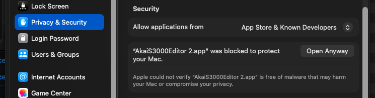
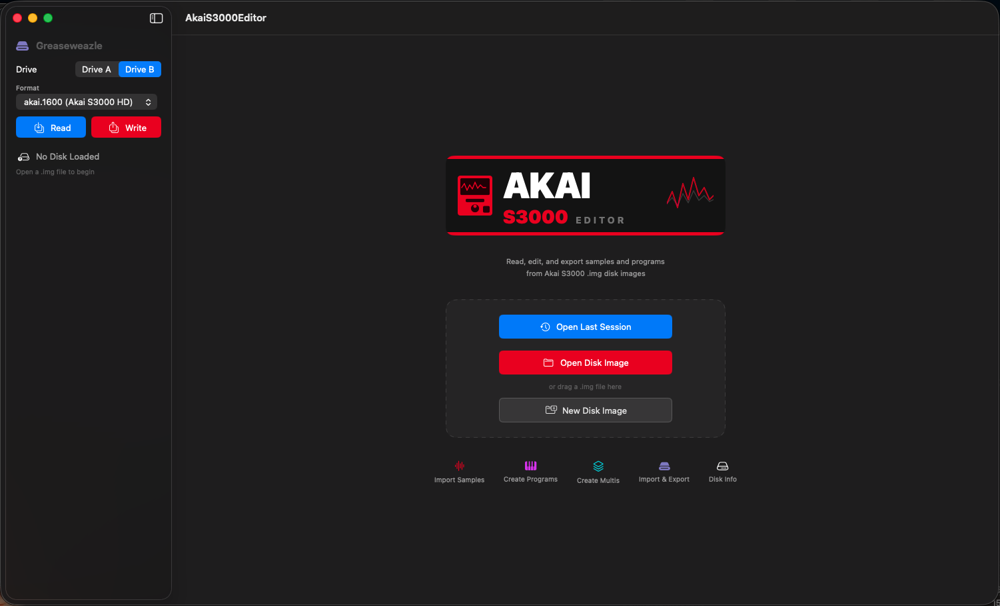
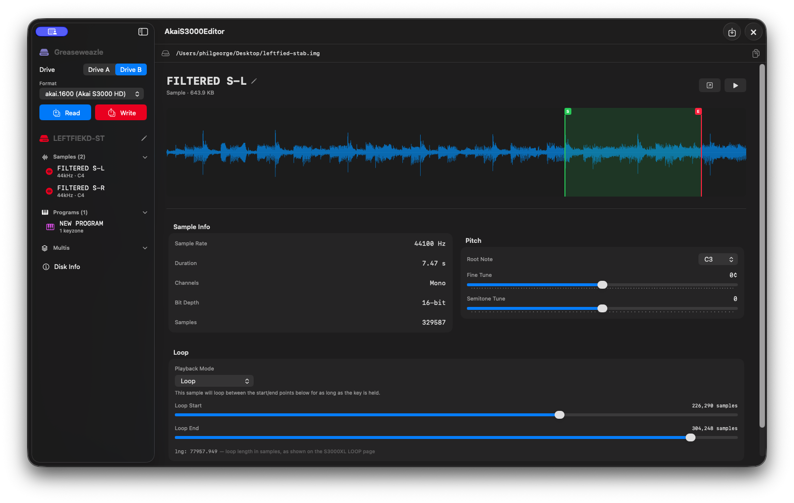
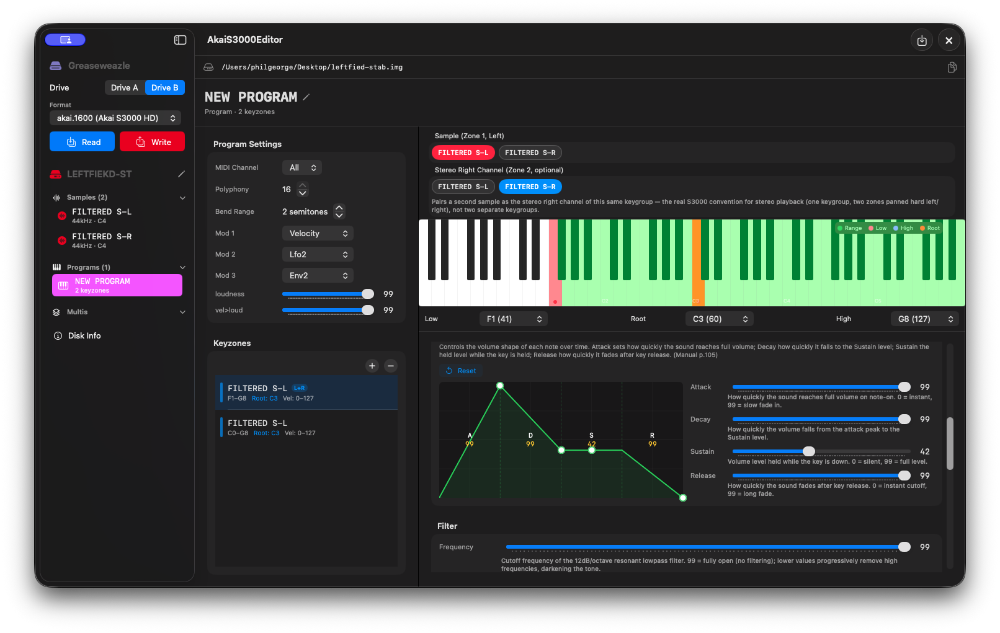
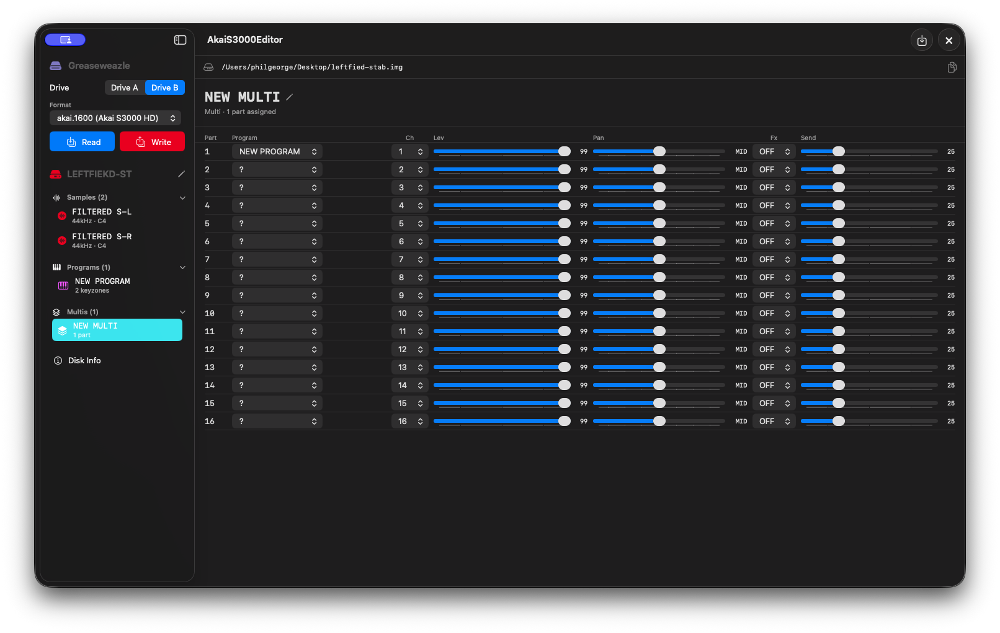
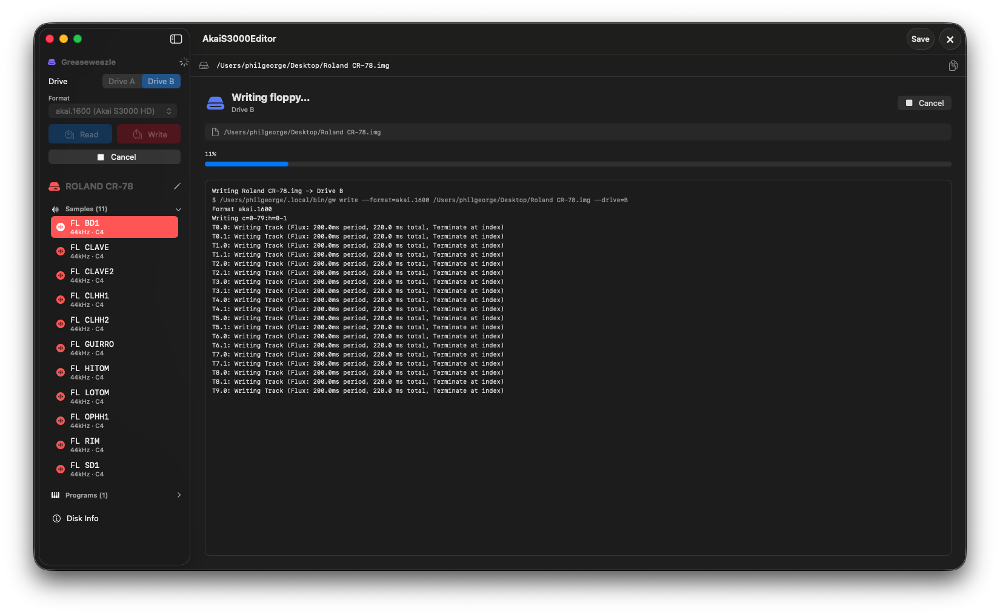
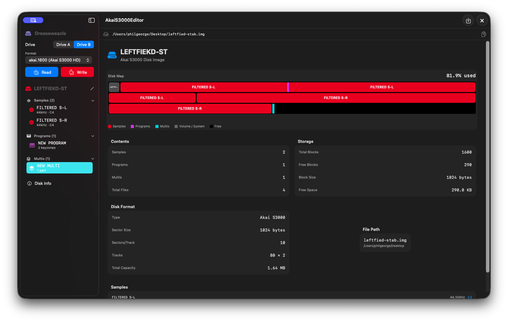

# Akai S3000 Floppy Disk Editor


This is a personal macOS project that allows me to read and write Akai S3000XL floppy disks using a UI that is super easy and powerful: quickly create programs, then drag and drop WAV files into keyzones with filter and loop settings, then save to an .img file. For reading and editing Akai S3000 floppy disk images (.img), I use the AMAZING [Greaseweazle](https://github.com/keirf/greaseweazle) floppy-to-USB-C card.

My app is built with SwiftUI — no dependencies — so it should run on most modern Macs. You will need to edit permissions in Settings to trust it, as it's not on the App Store yet!

**[View on GitHub](https://github.com/pageorge/Akai-S3000-Floppy-Disk-Editor)**

---

## Download

**[⬇️ Download latest build](https://github.com/pageorge/Akai-S3000-Floppy-Disk-Editor/releases/latest)**

1. Download `AkaiS3000Editor` from the link above
2. Run the App
3. On first launch modern Mac will say it can't run, go in to Settings -> Privacy & Security -> Open Anyway - I trust this guy!

<p align="center">
  
</p>

---

## Screenshots

<table>
  <tr>
    <td valign="top">
      <h3>Open last session, open an existing image or create a new image</h3>
      
    </td>
  </tr>
  <tr>
    <td valign="top">
      <h3>Drag in multiple wav/aiff samples and setup loop points</h3>
      
    </td>
  </tr>  
  <tr>    
    <td valign="top">
      <h3>Create or clone keyzones, drag samples in and choose single-key or full-keyboard layout. Set filter mods and ADSR graph</p>
      
    </td>
  </tr>
  <tr>
    <td width="50%" valign="top">
      <h3>Create multis and assign programs</h3>
      
    </td>
  </tr>
  <tr>
    <td width="50%" valign="top">
      <h3>Read / Write buttons call Greaseweazle commands and show log and progress writing to disk</h3>
      
    </td>
  </tr>
  
  <tr>
    <td valign="top">
      <h3>Floppy disk info and a map of where everything will be saved on disk</h3>
      
    </td>
  </tr>
  
</table>

---

## Requirements

- **macOS 14 Sonoma** or later
- No third-party dependencies

To build from source: **Xcode 15** or later.

---

## Building from source

1. Clone this repo
2. Open `AkaiS3000Editor.xcodeproj` in Xcode
3. Set your Development Team in Signing & Capabilities
4. Press **⌘R**

---

## Tips & Tricks

### Global settings are saved to disk

The S3000XL saves its global settings (master transpose, fine tune, MIDI channel assignments, etc.) into **blocks 0–4** of the floppy as part of a normal SAVE operation. When you load a disk, these settings are restored — including any transpose or tuning that was active when the disk was last saved.

**If samples play back at the wrong speed or pitch after loading a disk:** check the global TRANSPOSE and FINE TUNE settings (TUNE/MIDI button). A non-zero transpose saved to disk will affect all playback. Reset to zero and save back to the disk to fix it.

The app preserves blocks 0–4 faithfully when saving — it never modifies global settings. New disks created by the app initialise these blocks with hardware-captured factory defaults, byte-for-byte matching a freshly formatted S3000XL disk, ensuring correct global settings from the start.

### How to create a new program on the S3000XL

There's no separate "blank new program" function — every new program is made by copying an existing one (most simply, the built-in default TEST PROGRAM):

1. Go to EDIT PROGRAM → SINGLE
2. Press **NAME**, type your new program name (up to 12 characters, uppercase only), press **ENT**
3. Press **COPY** — this duplicates the current program under your new name

### How to assign samples to keyzones

Drag a WAV file (or folder of WAVs) onto a program in the main view. On the first drag, the app asks:

- **Single Key (C1, C#1, D1…)** — each sample maps to its own key starting at C1. Ideal for one-shots where you want each sound on a separate trigger key.
- **Full Keyboard (divide evenly)** — the keyboard range (C0–G8) is divided evenly across all samples. Ideal for pitched instruments.

This choice is remembered for the session. Subsequent drags onto the same program follow the same layout automatically.

### Sample root note

The sample's **root key** (`rkey`) tells the S3000 which pitch to play the sample at unity in TRACK mode. For single-key layouts, the app automatically sets `rkey` to match the trigger key (e.g. C1 for the first key) so each key plays its sample at recorded pitch.

`rkey` is stored on the **sample**, not the keyzone — if the same sample is used by two different keyzones on different keys, changing the root for one affects all uses of that sample.

### Clone Sample (shared PCM)

Right-click any sample in the sidebar → **Clone Sample**. This creates a second directory entry pointing to the same audio data on disk — no PCM bytes are duplicated, so the clone costs only a tiny directory entry (effectively free in terms of disk space).

Why this is powerful: the S3000 has no per-keyzone start or loop point — every keyzone referencing a sample uses the same trim and loop settings. If you want different parts of a long sample (e.g. a break or loop) to play on different keys, you'd normally have to duplicate the entire audio. Clone Sample sidesteps this: make several clones of the same sample, set a different start point or loop on each clone, then assign each clone to its own keyzone. You get multiple independent playback positions from a single copy of the audio on disk.

### Lo-fi / Convert to 22k

The "Convert to 22k" toggle in the Samples header downsamples imported WAVs from 44.1kHz to 22.05kHz, roughly halving their disk footprint. Use it when you need to fit more samples on one floppy. The bandwidth byte is automatically set to match the sample rate.

### How to use Multis

The S3000XL holds only one multi in memory at a time, but any number may be saved to disk (manual, p.35). Save named multis to disk and load whichever you need per session via **LOAD → MULTI+PROGS+SAMPS**.

**Note:** Hardware testing suggests the firmware always loads the first multi in the directory regardless of which file is selected from the load list. This appears to be a firmware behaviour.

---

## Technical Reference: Akai S3000 Disk Format

Sources: [Ohsaki/akaitools](https://lsnl.jp/~ohsaki/software/akaitools/S3000-format.html), [Midi-In/akaiutil](https://github.com/Midi-In/akaiutil), [keirf/GreaseWeazle](https://github.com/keirf/greaseweazle), Akai S3000XL Operator’s Manual, and direct hardware byte-diff testing on a real S3000XL.

All numbers little-endian. Akai character encoding: `0–9`=digits, `10`=space, `11–36`=A–Z, `37`=#, `38`=+, `39`=-, `40`=.

Key: `C`=byte, `v`=2-byte signed, `An`=n-byte Akai string, `x`=internal/sampler-managed, `*`=hardware-confirmed by this project, `?`=disputed or uncertain

---

### Physical layout (floppy)

```
akai.1600 (HD)   80 cylinders × 2 heads × 10 sectors × 1024 bytes = 1,638,400 bytes = 1600 blocks
akai.800  (DD)   80 cylinders × 1 head  × 10 sectors × 1024 bytes =   819,200 bytes =  800 blocks
```

---

### Disk structure

```
block 0–4     floppy header (akai_flhhead_s)
block 5–16    volume directory (510 × 24-byte entries, spans 12 blocks)
block 17+     file data (FAT-chained)
```

#### Floppy header block 0 — 64 × 24-byte slots

```
00-0b    A12   volume name (Akai-encoded, repeated in every slot)
0c-0d    C2    00 00
0e-0f    C2    04 0b  (tag)
10       C     ff=slot 0 (volume sentinel), 00=other slots
12       C     10     (undocumented field, hardware-confirmed *)
17       C     11     (osver)
```

#### Global settings — block 4 offset 0x292

```
292-299  C8    01 00 00 00 32 09 0c ff   factory defaults *
                                          leaving zero → corrupt transpose on load
```

#### FAT — one 16-bit LE entry per block

```
0000    free
4000    system (reserved)
c000    end of file chain
other   next block number
```

#### Volume directory entry — 24 bytes

```
00-0b    A12   file name
0c-0f    C4    tag (S3000 free = 00)
10       C     file type:
                 f3 = S3000 sample
                 f0 = S3000 program
                 ed = multi
                 64 = drum inputs (SAVE→DRUM)
                 78 = effects file
                 74 = take list
11-13    C3    file size in bytes (24-bit LE)
14-15    C2    start block
16-17    C2    osver (samples=0000, programs=1100)
```

---

### Sample file (type f3)

```
0000-00bf    sample header
00c0-        PCM data (16-bit signed LE mono)
```

#### Sample header — 0xc0 bytes

```
00       C     03  (S3000 block id)
01       C     bandwidth: 0=10kHz (≤22kHz), 1=20kHz (≥33kHz)  *derived from srate
02       C     original pitch / root key (24-127 = C0-G8)  *
03-0e    A12   sample name
0f       C     80 = sample rate valid
10       C     # of active loops (lnum): 0=none, 1=looping  *must match pmode
11       C     first active loop (internal)
12       C     dummy
13       C     playback type: 0=loop, 1=loop until release, 2=no loop, 3=play to end
14       C     pitch offset cents / 256 (fine tune)
15       C     pitch offset semitones
16-19    x4    data absolute start address (sampler RAM, internal)
1a-1d    C4    data length in samples (slen)
1e-21    C4    play start address (TRIM start, draggable in app *)
22-25    C4    play end address
26-85           8 loop slots, each 12 bytes:
  +00-03  C4    loop at  (right-hand boundary; region is [at-len, at) )
  +04-05  C2    loop len decimal / 65536 (flen, read for rounding, written as 0)
  +06-09  C4    loop len
  +0a-0b  C2    loop time: 0=off, 9999=hold, 1-9998=ms
                  * ALL 8 slots must be 0 for no-loop; 9999 in any slot forces loop
                  * app replicates active loop into slots 0-3 when looping
86-87    C2    dummy
88-89    x2    stereo partner address (0xffff=none)
8a-8b    C2    sample rate in Hz
8c       C     hold loop tune offset
8d-bf           reserved / unknown
```

---

### Program file (type f0)

```
0000-00bf    program common data
00c0-017f    keygroup 1
0180-023f    keygroup 2
  ...
```

#### Program common data — 0xc0 bytes

```
00       C     01  (program block id)
01-02    x2    1st keygroup address (internal)
03-0e    A12   program name
0f       C  0  MIDI program number (0-127)
10       C  0  MIDI channel (0-15, ff=omni)  *
11       C 31  polyphony (value = voices-1, so 31=32 voices)  *
12       C  1  priority: 0=low, 1=normal, 2=high, 3=hold  *
13       C 24  play range low (24-127 = C0-G8)
14       C127  play range high
15       C  0  play octave shift ±2  [Ohsaki] / bend range down 0-24 [our use] ?
16       C ff  individual output (0-7, ff=off)
17       C 99  stereo level 0-99  *
18       C  0  stereo pan
19       C 80  loudness 0-99  *
1a       C 20  velocity > loud  *
1b       C  0  key > loud
1c       C  0  pressure > loud
1d       C  0  pan LFO rate
1e       C 99  pan depth
1f       C  0  pan LFO delay
20       C  0  key > pan position
21       C 50  LFO speed
22       C  0  LFO fixed depth
23       C  0  LFO delay
24       C 30  modwheel > depth
25       C  0  pressure > depth
26       C  0  velocity > depth
27       C  2  bendwheel > pitch (bend up 0-24)  *
28       C  0  pressure > pitch  *
29       C  0  keygroup crossfade (0=off, 1=on)
2a       C  #  # of keygroups (1-99)  *
2b       C n/a temporary program number (internal)
2c-37    C12   key temperament
38       C  0  echo output level (0=off, 1=on)
39       C  0  modwheel pan amount
3a       C  0  sample start coherence (0=off, 1=on)
3b       C  0  LFO de-sync (0=off, 1=on)
3c       C  0  pitch law
3d       C  0  voice assign: 0=oldest, 1=quietest  *
3e       C 10  soft pedal loudness reduction
3f       C 10  soft pedal attack stretch
40       C 10  soft pedal filter close
41-42    v  0  tune offset
43       C  0  key > LFO rate
44       C  0  key > LFO depth
45       C  0  key > LFO delay
46       C 50  voice output scale
47       C  0  stereo output scale
48-bf           reserved / unknown
49       C  2  unknown, default 2  ?
4a       C  0  bend mode: 0=normal, 1=held  *
54       C  5  filter mod source #1 (0-13, see below)  *
55       C  8  filter mod source #2  *
56       C 10  filter mod source #3  *
```

#### Keygroup — 0xc0 bytes each

```
00       C  2  keygroup block id
01-02    x2    next keygroup address (internal)
03       C 24  keyrange low  *
04       C127  keyrange high  *
05-06    v  0  tune offset
07       C 99  filter freq. 0-99  *
08       C  0  key > filter freq. (factory default 0, not manual’s +12)  *
09       C  0  velocity > filter freq.
0a       C  0  pressure > filter freq.
0b       C  0  envelope > filter freq.
0c       C 25  amp. attack  *
0d       C 50  amp. decay  *
0e       C 99  amp. sustain  *
0f       C 45  amp. release  *
10       C  0  velocity > amp. attack
11       C  0  velocity > amp. release
12       C  0  off velocity > amp. release
13       C  0  key > decay & release
14       C  0  filter attack (ENV2 rate 1)  *
15       C 50  filter decay (ENV2 rate 3)  *
16       C 99  filter sustain (ENV2 level 3)  *
17       C 45  filter release (ENV2 rate 4)  *
18       C  0  velocity > filter attack
19       C  0  velocity > filter release
1a       C  0  off velocity > filter release
1b       C  0  key > decay & release
1c       C 25  velocity > filter envelope output
1d       C  0  envelope > pitch
1e       C  1  velocity zone crossfade (0=off, 1=on)
1f       C n/a # of velocity zones (internal)
20-21    C2n/a internal  *must be 0xffff or zone 1 is silent
22-82           4 velocity zones (0x18 bytes each, see below)
83       C  0  fixed rate detune
84       C  0  attack hold until loop  [Ohsaki] / pitchMode TRACK/CONST [our use]  ?
85-88    C4 0  constant pitch zones 1-4: 0=track, 1=const  [Ohsaki]
89-8c    C4 0  output number offset zones 1-4
8d-94    v4 0  velocity > sample start zones 1-4
95       C  0  resonance 0-15  *
96-bf           reserved / unknown
97       C  0  vel. > filter freq. (filter mod depth #1)  *
98       C  0  pres. > filter freq. (filter mod depth #2)  *
99       C  0  env. > filter freq. (filter mod depth #3)  *
9c       C 99  ENV2 level 1  *
9d       C 50  ENV2 rate 2  *
9e       C 99  ENV2 level 2  *
9f       C  0  ENV2 level 4  *
```

#### Velocity zone — 0x18 bytes (4 zones at keygroup offsets 0x22, 0x3a, 0x52, 0x6a)

```
00-0b    A12   sample name
0c       C  0  velocity low
0d       C127  velocity high
0e       C  0  tune offset cents / 256
0f       C  0  tune offset semitones
10       C  0  loudness offset
11       C  0  filter freq. offset
12       C  0  pan offset
13       C  0  loop mode: 0=sample setting, 1=loop, 2=loop until release,
                           3=no loop, 4=play to end
14-15    C2    reserved
16-17    x2    sample header block address (internal)

Zone 1 = primary sample. Zone 2 = stereo right channel (panned hard L/R).
Zones 3-4 unused in this app.
```

#### Filter mod sources (0x54-0x56, index 0-13)

```
 0  No Source    7  Key
 1  Modwheel     8  Lfo1
 2  Bend         9  Lfo2
 3  Pressure    10  Env1
 4  External    11  Env2
 5  Velocity    12  !Modwheel
 6  (unused)    13  !Bend      14  !External
```

---

### Multi file (type ed)

```
0000-03ff    multi header
0400-04bf    part 1
04c0-057f    part 2
  ...        (16 parts, 0xc0 bytes each)
```

#### Multi header

```
000-002    C3    00 00 00
003-00e    A12   internal name (Akai reads this, not the directory entry name)  *
00f-3ff           unknown, preserved
```

#### Part record — 0xc0 bytes (base = 0x400 + (N-1) * 0xc0)

```
+00      C     01  (record marker)
+01-02   x2    program link pointer (internal)
+03-0e   A12   program name  *
+0f      C     padding
+10      C     MIDI channel 0-indexed  *
+11-16   C6    unknown, preserved
+17      C 99  level 0-99  *
+18      C     pan signed  *
+19-70   C88   unknown (OUT/TUNE/RNGE/PRIO), preserved
+71      C     FX bus: 0=off, 1=FX1, 2=FX2, 3=RV3, 4=RV4  *
+72      C     FX send 0-99  *
+be-bf   C2    end link pointer: ffff=unassigned  *must be ffff or wrong multi loads
```

---

### Default discrepancies (manual vs hardware)

```
Filter Key Follow    manual says +12    hardware shows 0   *
Loudness             manual says 80     hardware shows 99  *  (program-level)
Velocity > Loud      manual says 20     hardware shows 99  *
```

---

### Cross-reference: disputed or unconfirmed offsets

```
Program 0x15   Ohsaki: play octave shift ±2
               This app: bend range down 0-24
               Status: not yet hardware-confirmed  ?

Keygroup 0x84  Ohsaki: attack hold until loop
               This app: pitchMode TRACK/CONST
               Ohsaki also notes "84??" next to 0x85-88 constant pitch
               Status: hardware-confirmed TRACK/CONST works at 0x84 *
                       but Ohsaki’s 0x85-88 layout not yet tested  ?

Keygroup 0x85-88  Ohsaki: constant pitch zones 1-4 (0=track, 1=const)
               This app: writes pitchMode at 0x84 only (zone 1)
               Status: zones 2-4 pitch mode unverified  ?
```

---

### Field knowledge cross-reference

Status codes: `agree`=all sources agree, `our finding`=not in Ohsaki or manual, `dispute`=we disagree with a source, `not modelled`=known but not implemented, `?`=uncertain

```
PROGRAM HEADER

offset  ohsaki              manual    this project              status
------  ------              ------    ------------              ------
0x10    MIDI channel        yes       confirmed *               agree
0x11    polyphony           yes       confirmed *               agree
0x12    priority            yes       confirmed *               agree
0x15    octave shift ±2     -         we write bend down here   dispute ?
0x17    stereo level        yes       confirmed *               agree
0x19    loudness            yes       confirmed * (default 99)  agree / manual wrong default
0x1a    velocity > loud     yes       confirmed *               agree
0x27    bend up 0-24        yes       confirmed *               agree
0x28    pressure > pitch    yes       confirmed * (default 0)   agree
0x2a    # of keygroups      yes       confirmed *               agree
0x3d    voice assign        yes       confirmed *               agree
0x49    -                   -         default 2, unknown        our finding ?
0x4a    -                   -         bend mode NORMAL/HELD *   our finding
0x54    -                   -         filter mod source 1 *     our finding
0x55    -                   -         filter mod source 2 *     our finding
0x56    -                   -         filter mod source 3 *     our finding
0x18    stereo pan          yes       not modelled              not modelled
0x1b-c  key/pressure>loud   yes       not modelled              not modelled
0x1d-f  pan LFO             yes       not modelled              not modelled
0x20-6  LFO/mod params      yes       not modelled              not modelled
0x29    kg crossfade        yes       not modelled              not modelled
0x38    echo output         yes       not modelled              not modelled
0x39    modwheel pan        yes       not modelled              not modelled
0x3a    start coherence     yes       not modelled              not modelled
0x3b    LFO de-sync         yes       not modelled              not modelled
0x3c    pitch law           yes       not modelled              not modelled
0x3e-40 soft pedal          yes       not modelled              not modelled
0x41-42 tune offset         yes       not modelled              not modelled
0x43-45 key > LFO           yes       not modelled              not modelled
0x46-47 output scale        yes       not modelled              not modelled

KEYGROUP

offset  ohsaki              manual    this project              status
------  ------              ------    ------------              ------
0x03    keyrange low        yes       confirmed *               agree
0x04    keyrange high       yes       confirmed *               agree
0x07    filter freq         yes       confirmed *               agree
0x08    key > filter        yes       confirmed * (default 0)   agree / manual wrong default
0x0c-f  amp ADSR            yes       all confirmed *           agree
0x14-17 filter ENV2         yes       all confirmed *           agree
0x20-21 internal            yes       must be 0xffff *          agree / extended (silence bug)
0x84    attack hold loop    yes       we write pitchMode here   dispute ?
0x85-88 const pitch zones   yes       not yet tested            dispute ?
0x95    -                   -         resonance 0-15 *          our finding
0x97    -                   -         filter mod depth 1 *      our finding
0x98    -                   -         filter mod depth 2 *      our finding
0x99    -                   -         filter mod depth 3 *      our finding
0x9c-9f -                   -         ENV2 levels/rates *       our finding
0x05-06 tune offset         yes       not modelled              not modelled
0x09-0b vel/pres/env>filt   yes       not modelled              not modelled
0x10-13 vel/key > amp       yes       not modelled              not modelled
0x18-1b vel/key > filter    yes       not modelled              not modelled
0x1c    vel > filter env    yes       not modelled              not modelled
0x1d    envelope > pitch    yes       not modelled              not modelled
0x83    fixed rate detune   yes       not modelled              not modelled
0x89-8c output offset       yes       not modelled              not modelled
0x8d-94 vel > sample start  yes       not modelled              not modelled

SAMPLE HEADER

offset  ohsaki              manual    this project              status
------  ------              ------    ------------              ------
0x01    bandwidth           yes       confirmed * (derived)     agree
0x02    root key            yes       confirmed *               agree
0x10    # active loops      yes       confirmed * (lnum)        agree
0x13    playback mode       yes       confirmed *               agree
0x1a-1d data length         yes       confirmed *               agree
0x1e-21 play start          yes       confirmed * (draggable)   agree
0x26-85 loop slots [8]      yes       confirmed * + critical    agree / extended
0x8a-8b sample rate         yes       confirmed *               agree
```

---

### Reading a floppy with GreaseWeazle

```bash
gw read --format=akai.1600 my_disk.img --drive=B
```

### Writing a floppy with GreaseWeazle

```bash
gw write --format=akai.1600 my_disk.img --drive=B
```

The app automatically passes `--tracks=c=0-N` when writing, where N is the last cylinder containing data. This skips writing empty tracks and can reduce write time by up to 68% for sparse disks.

---

## Special thanks

- **[Midi-In / akaiutil](https://github.com/Midi-In/akaiutil)** — definitive reference for S1000/S3000 character encoding, FAT structure, and file types.
- **[dialtr / akai-fs](https://github.com/dialtr/akai-fs)** — filesystem parsing, WAV export logic, and sample header layout.
- **[keirf / GreaseWeazle](https://github.com/keirf/greaseweazle)** — the hardware and software that makes reading real Akai floppies on modern hardware possible.
- **The original Akai S3000XL Operator's Manual** — parameter semantics, ranges, and behaviour.

---

## Useful links

- [GreaseWeazle](https://github.com/keirf/greaseweazle)
- [akaiutil (Midi-In)](https://github.com/Midi-In/akaiutil)
- [akai-fs (dialtr)](https://github.com/dialtr/akai-fs)
- [AKAI S3000 Series Disk and File Format](https://lsnl.jp/~ohsaki/software/akaitools/S3000-format.html) — reverse-engineered format reference by Hiroyuki Ohsaki (1993), covering disk structure, FAT, volume entries, sample headers, program and keygroup layouts in detail
- [Akai S3000XL Wikipedia](https://en.wikipedia.org/wiki/Akai_S3000XL)

---

*Personal project — use at your own risk. Always keep backups of your disk images before saving changes.*
